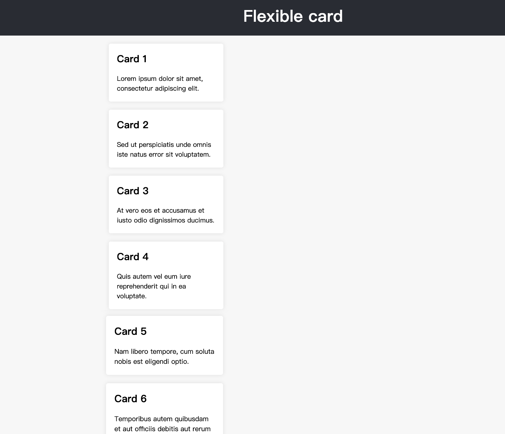
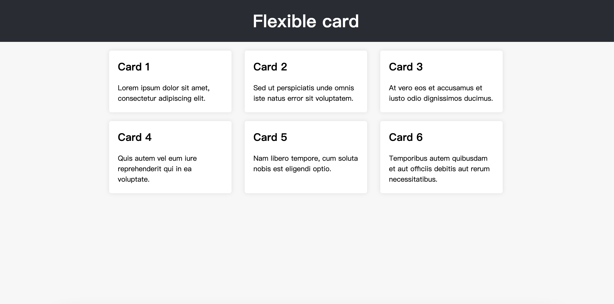

# Flexible Card

To get started, open the editor on the right. You should see two files — `flexible_card.html` and `flexible_card.css` from your editor. You can see it as follows:

You'll see that we have a `<header>` element with a top level heading inside it and a `<section>` element containing three `<article>`. We're going to use these to create a fairly standard three column layout.

## Requirements

- Please click "Go Live" in the bottom right corner to open port 8080.
- Please complete this challenge in the `flexible_card.css` file.
- You need to select which elements are to be laid out as flexible boxes.
- You need to add the `flex-wrap` properties to controls their container.
- You need to add `justify-content` properties to controls where the flex items sit on the main axis.

## Example

The finished result is as follows:

