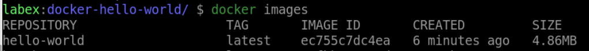

# Containerize a "Hello, World!" Application

## Introduction

In this step, you will containerize a simple "Hello, World!" application using Docker.

## Target

The target of this step is to create a Docker container that runs a "Hello, World!" application.

## Result Example

1. Create a new directory called `docker-hello-world` in `/home/labex/project` path and navigate to this directory.

2. Create a file named `Dockerfile` in `/home/labex/project/docker-hello-world` path with the following content:

   - Use `busybox` runtime as a parent image
   - Run `echo "Hello, World!"` command

3. Use the `docker build` command to Build `hello-world` image.

4. When you run the Docker container with `hello-world` image, you should see the message "Hello, World!".

