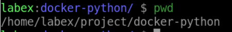
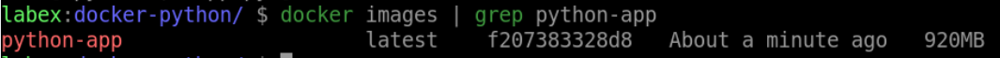
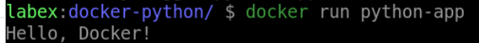

# Containerize a Python Application

## Introduction

In this step, you will containerize a Python application using Docker.

## Target

The target of this step is to create a Docker container that runs a Python application.

## Result Example

1. Create a new directory called `docker-python` in `/home/labex/project` path and navigate to this directory.



2. Create a file named `Dockerfile` in `/home/labex/project/docker-python` path with the following contents:

   - Use `python:3` as a parent image
   - Set the working directory to /app
   - Add the current directory contents into the container at /app
   - Run the `["python", "app.py"]` command to start the server

3. Create a file named `app.py` in your project directory `/home/labex/project/docker-python` with the following contents:

```python
print("Hello, Docker!")
```

4. Use the `docker build` command to Build `python-app` image.



5. When you run the Docker container with `python-app` image, you should see the output of the Python application.


