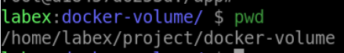
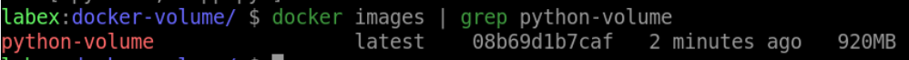
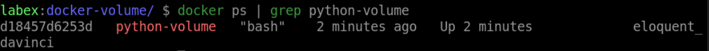
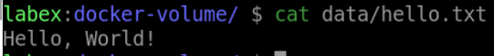

# Persist Data Using Docker Volumes

## Introduction

In this step, you will learn how to use Docker volumes to persist data.

## Target

The target of this step is to create a Docker container that uses a volume to persist data.

## Result Example

1. Create a new directory called `docker-volume` in `/home/labex/project` path and navigate to this directory.



2. Create a file named `Dockerfile` in `/home/labex/project` path with the following contents:

   - Use `python:3` as a parent image
   - Set the working directory to /app
   - Add the current directory contents into the container at /app
   - creates a mount point at /data
   - Run the `["python", "app.py"]` command to start the server

3. Create a file named `app.py` in your project directory `/home/labex/project/docker-volum` with the following contents:

```python
print("Hello, Docker-volume!")
```

4. Use the `docker build` command to Build `python-volume` image.



5. Run the Docker container with `python-volume` image, use `-v` mount to the host `$(pwd)/data` path. Use `-it` to interact with the container. Inside the container, write data to the mounted volume. Finally, use `CTRL+p+q` to make the container run.



6. Validate the Docker volume to persist the data. In the current directory of host, there is a `data` directory with a `hello.txt` file.


