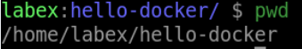

# Create a Docker Image

## Introduction

In this step, we will build a Docker image using Dockerfile.

## Target

Your goal is to use `Dockerfile` to build an image based on `nginx:latest` and named `my-web-server`, which will contain an html file with the content `Hello Docker!`.

## Result Example

Here is an example of what you should be able to accomplish at the end of this step:

1. Create a new directory called `hello-docker` at `/home/labex/` path and navigate into it.



2. Create a file named `Dockerfile` with the following content:

```dockerfile
FROM nginx:latest
COPY index.html /usr/share/nginx/html/
```

3. Create an `index.html` file with the following content:

```html
<!DOCTYPE html>
<html>
  <head>
    <title>Hello Docker!</title>
  </head>
  <body>
    <h1>Hello Docker!</h1>
  </body>
</html>
```

4. Build the Docker image called `my-web-server`.


## Requirements

- Docker must be installed on your machine.
