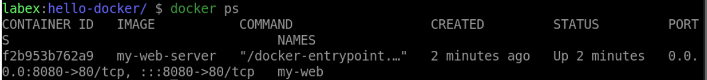
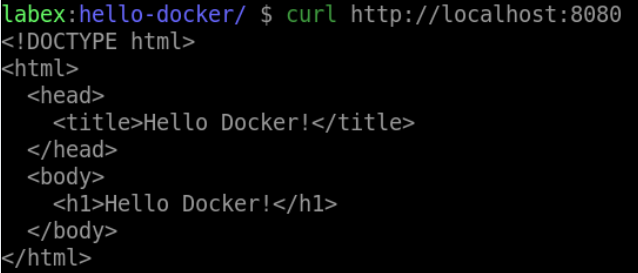
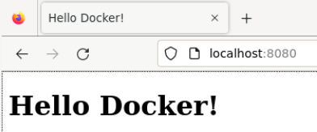

# Run a Docker Container

## Introduction

In this step, we will run a Docker container based on the image we created in the previous step.

## Target

Your goal is to start a new container in detached mode, with port forwarding from host port 8080 to container port 80. The container will run the `my-web-server' image we created in the previous step. And then use a web browser to access it.

## Result Example

Here is an example of what you should be able to accomplish at the end of this step:

1. Start a new container called `my-web` based on the `my-web-server` image. The container port forwarding from the host port 8080 to the container port 80.

2. Use `curl` command to see the web page served by the container.

## Requirements

- Docker must be installed on your machine.
