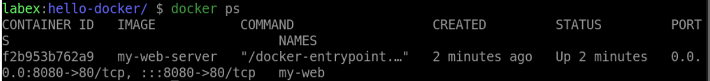
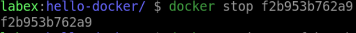
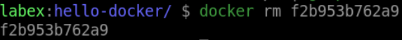

# Manage Docker Containers

## Introduction

In this step, we will learn how to manage Docker containers.

## Target

Your goal is to use `docker ps`, `docker stop`, and `docker rm` to manage running containers.

## Result Example

Here is an example of what you should be able to accomplish at the end of this step:

1. Lists all running containers.

2. Stop the container which has the name `my-web`.

3. Remove the `my-web` container that we have stopped.

## Requirements

- Docker must be installed on your machine.
