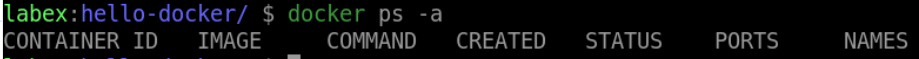
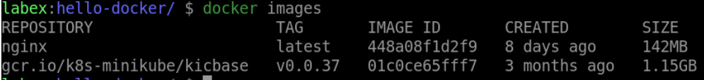

# Clean up

## Introduction

In this step, we will clean up the resources we created in the previous steps.

## Target

Your goal is to stop and remove all running containers. Then remove the `my-web-server` image.

## Result Example

Here is an example of what you should be able to accomplish at the end of this step:

1. Stop and remove all running containers.

2. Removes the Docker image with the tag `my-web-server`.

## Requirements

- Docker must be installed on your machine.
