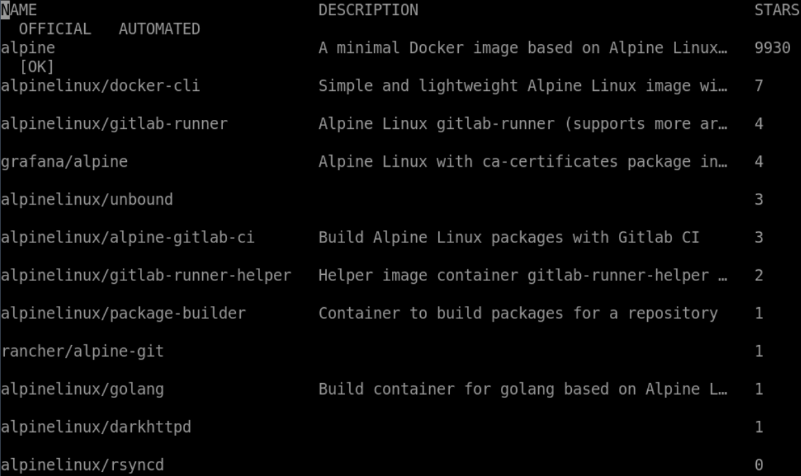

# Basic Search

## Introduction

In this step, you will use the `docker search` command to search for an image on the Docker Hub registry.

## Target

- Search for `nginx` image on the Docker Hub registry.

## Example

Here is an example of what you should be able to accomplish at the end of this step:

1. Open a terminal or command prompt on your local system.
2. Search for the `alpine` image on the Docker Hub registry.

