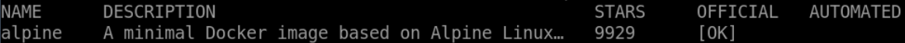

# Filtering Search Results

## Introduction

In this step, you will use the `docker search` command to search for an image on the Docker Hub registry, but with more specific criteria.

## Target

- Search for `nginx` image on the Docker Hub registry and filter search results by specifying additional search criteria.

## Example

Here is an example of what you should be able to accomplish at the end of this step:

1. Open a terminal or command prompt on your local system.
2. Search the `alpine` image on the Docker Hub registry, but only return official images

