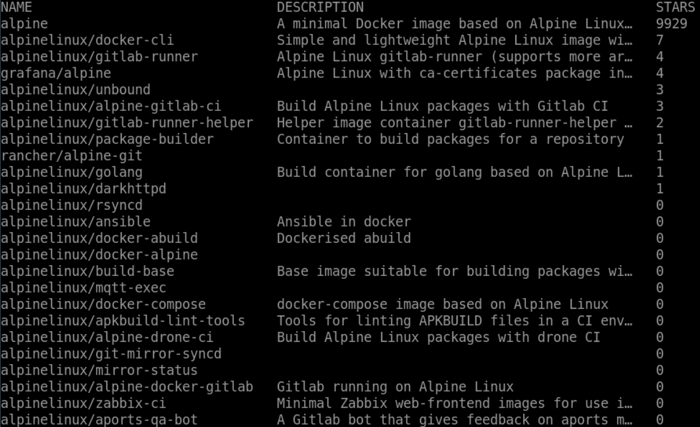

# Displaying More Information

## Introduction

In this step, you will use the `docker search` command to search for an image on the Docker Hub registry and display more information about the search results.

## Target

- Search for `nginx` image on the Docker Hub registry and display more information about the search results.

## Example

Here is an example of what you should be able to accomplish at the end of this step:

1. Open a terminal or command prompt on your local system.
2. Search for the `alpine` image on the Docker Hub registry and display the name, description, and star count in a table format.



## Tip

You can use the following to make the results display the name, description and number of stars in a table format.

```zsh
table {{.Name}}\t{{.Description}}\t{{.StarCount}}
```
