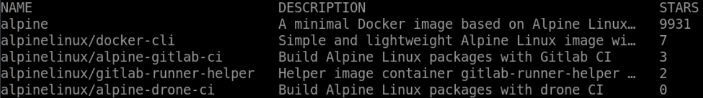

# Show Max Number of Search Results

## Introduction

In this step, you will use the docker search command to search for an image on the Docker Hub registry and show the max number of search results.

## Target

- Search for `nginx` image on the Docker Hub registry and display the first `5` search results by specific criteria.

## Example

Here is an example of what you should be able to accomplish at the end of this step:

1. Open a terminal or command prompt on your local system.
2. Search for the `alpine` image on the Docker Hub registry and display the name, description and number of stars in a table showing the top `5` data of the search results.

