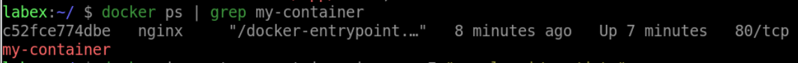
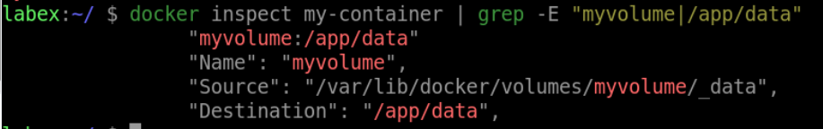

# Mount a Docker Volume in a Container

## Introduction

To use a Docker volume in a container, you need to mount it as a directory inside the container. You can do this by using the `-v` option when running a container:

## Target

Your goal is to run a new Docker container based on the `nginx` image and mounts the `myvolume` volume as a directory inside the container at the `/app/data` path.

## Result Example

Here is an example of what you should be able to accomplish at the end of this step:

1. Create a new Docker container called `my-container` based on the `nginx` image and mounts the `myvolume` volume as a directory inside the container at the `/app/data` path.

2. Verify that the volume is mounted correctly by running the `docker inspect` command.

## Requirements

- Docker must be installed on your machine.
