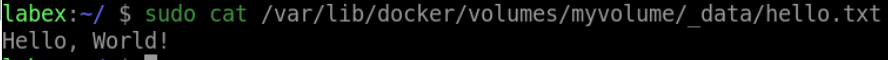

# Write Data to a Docker Volume

## Introduction

In this lab, we will learn how to write data to a Docker volume, you can simply write to the directory where the volume is mounted inside the container.

## Target

Your goal is to go into the `my-container` container in the `/app/data/hello.txt` file and write the content `Hello, World!`.

## Result Example

Here is an example of what you should be able to accomplish at the end of this step:

1. Go into the `my-container` container in the `/app/data/hello.txt` file and write the content `Hello, World!`.

2. Verify that the file is created on your host machine.

## Requirements

- Docker must be installed on your machine.
