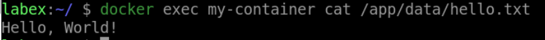

# Read Data From a Docker Volume

## Introduction

In this lab, we will learn how to read data from a Docker volume, you can simply read from the directory where the volume is mounted inside the container.

## Target

Your goal is to go into the `my-container` container and output the contents of the `/app/data/hello.txt` file.

## Result Example

Here is an example of what you should be able to accomplish at the end of this step:

Go into the `my-container` container and output the contents of the `/app/data/hello.txt` file.

## Requirements

- Docker must be installed on your machine.
