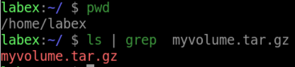
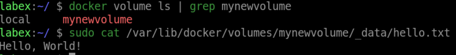

# Backup and Restore a Docker Volume

## Introduction

In this lab, we will learn how to backup and restore a docker volume.

## Target

Your goal is to create a tarball of the `myvolume` volume data and saves it to the current directory on your host machine. And then we will create a new volume called `mynewvolume` and restore the backup to it.

## Result Example

Here is an example of what you should be able to accomplish at the end of this step:

1. Create a tarball of the `myvolume` volume data and saves it to the current directory called `/app/data` on your host machine.

2. Create a new volume called `mynewvolume` and extracts the tarball to the `/app/data` directory inside the container.

## Requirements

- Docker must be installed on your machine.
