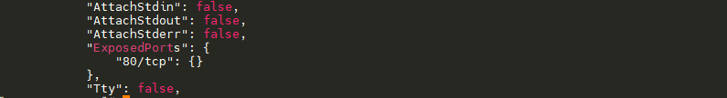

## List the Public-Facing Ports of a Container

### Introduction

In this step, you will learn how to list the public-facing ports of a container using the `docker inspect` command.

### Target

Use `docker inspect` command to list public-facing ports to the `my-nginx` container.

### Result Example

Here is an example of what you should be able to accomplish at the end of this step:

1. Open a terminal or command prompt.
2. List the public-facing ports of the `my-nginx` container.

### Requirements

- The container must be running.

