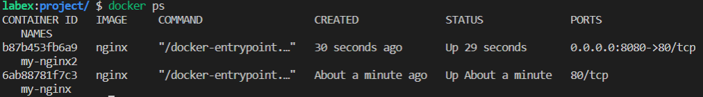

# Map a Port to a Specific IP Address

## Introduction

In this step, you will learn how to map a port to a specific IP address using the `docker run` command.

## Target

Map port `8080` to IP address `0.0.0.0` for the `my-nginx2` container.

## Result Example

Here is an example of what you should be able to accomplish at the end of this step:

1. Open a terminal or command prompt.
2. Map port `8080` to IP address `0.0.0.0` for the `my-nginx2` container.

