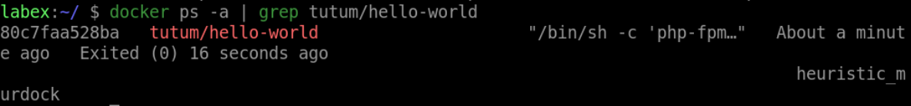
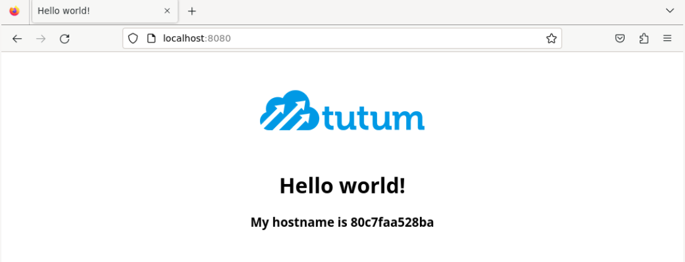

# Install and Run a Docker Image

## Introduction

In this step, you will learn how to install and run a Docker image. A Docker image is a lightweight, stand-alone, and executable package that includes everything needed to run an application, including the code, a runtime, libraries, environment variables, and config files.

## Target

The target of this step is to install and run a Docker image of a simple web application.

## Requirements

- You will need to have Docker installed on your system.
- A working internet connection to download the Docker image.

## Result Example

1. Use `docker run` command to download and run `tutum/hello-world` image of a web application.

2. Wait for Docker to download the image and start the container.

3. Open your web browser and navigate to `http://localhost:8080` to access the web application.

