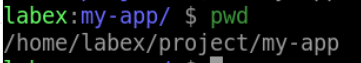
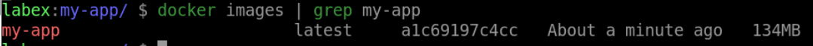
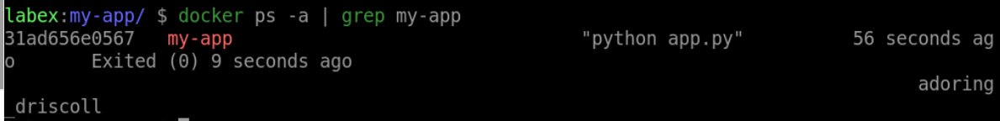
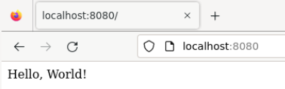

# Build a Docker Image

## Introduction

In this step, you will learn how to build a Docker image from a Dockerfile. A Dockerfile is a text file that contains instructions on how to build a Docker image, such as specifying the base image, copying files, setting environment variables, and running commands.

## Target

The target of this step is to build a Docker image of a custom web application.

## Requirements

- A text editor to create the Dockerfile.
- The source code of a simple web application.

## Result Example

1. Create a new directory called `my-app` and navigate to it in `/home/labex/project` path.



2. Create a file named `Dockerfile` in the directory with the following content:

   - Use python:3.7-slim as a parent image
   - Set the working directory to /app
   - Copy the current directory contents into the container at /app
   - Use pip install the required packages and not to use the cache directory for downloaded packages, use -r flag to specify the requirements.txt file.
   - Set the environment variables PORT=80
   - Expose the port
   - Run ["python", "app.py"] command to start the server

3. Create a file named `requirements.txt` in the directory with the following content:

```bash
flask
```

4. Create a file named `app.py` in the directory with the following content:

```python
from flask import Flask
import os

app = Flask(__name__)

@app.route("/")
def hello():
    return "Hello, World!"

if __name__ == "__main__":
    app.run(debug=False, host='0.0.0.0', port=int(os.environ.get('PORT', 80)))
```

5. Use `docker build` command to build `my-app` image.



6. Use `docker run` command to run a Docker container using the `my-app` image.



7. Open your web browser and navigate to `http://localhost:8080` to access the web application.


