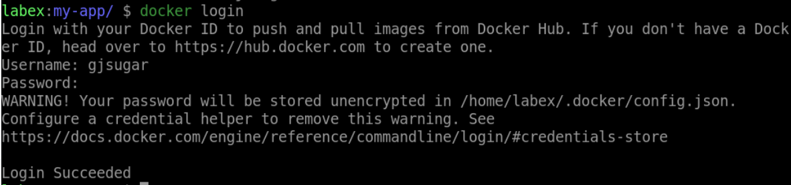

# Store a Docker Image on Docker Hub

## Introduction

In this step, you will learn how to store a Docker image on Docker Hub, a cloud-based registry for storing and sharing Docker images. Docker Hub allows developers to share, distribute, and collaborate on Docker images, as well as automate the build and deployment process.

## Target

The target of this step is to store a Docker image on Docker Hub and use it to deploy a web application.

## Requirements

- A Docker Hub account `(https://hub.docker.com)`.
- A Docker image built in the previous step.

## Result Example

1. Log in to Docker Hub using `docker login` command.

2. Use `docker tag` command to tag the Docker image with your Docker Hub account.

3. Use `docker push` command to push the Docker image to Docker Hub.

4. use `docker rmi` command to delete `<your_username>/my-app` image.

5. Use `docker pull` command to pull `<your_username>/my-app` image from Docker Hub.

6. Use `docker run` command to start a Docker container using the pulled image.

7. Open your web browser and navigate to `http://localhost:80` to access the web application.

