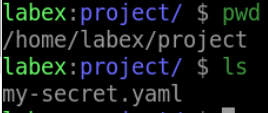
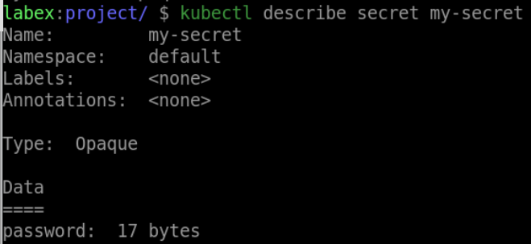
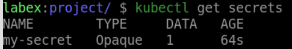

# Create a Secret

## Introduction

In Kubernetes, secrets play a vital role in securely managing sensitive information required by applications running within the cluster. Whether it's authentication credentials, encryption keys, or other confidential data, Kubernetes Secrets offer a reliable solution for storing and accessing this information securely. In this tutorial, we will explore the process of creating a Secret in Kubernetes, enabling you to effectively manage and protect sensitive data within your application deployments.

## Target

Your goal is to create a Secret called `my-secret` with the type is `Opaque`. This Secret contains a single key-value pair, where the key is `password` and the value is `dXNlcm5hbWU6cGFzc3dvcmQ=`.

## Result Example

Here is an example of what you should be able to accomplish at the end of this step:

1. Create a file named `my-secret.yaml`, The content of the YAML is created as follows:

- The name of the Secret is `my-secret`.
- The type of the Secret is `Opaque`.
- The data of the Secret is in key-value form, where key is `password and` value is `dXNlcm5hbWU6cGFzc3dvcmQ`.

2. Use `kubectl apply` command to deploy the YAML file.

3. Verify that the Secret was created.

## Requirements

To complete this challenge, you will need:

- A Kubernetes cluster has been installed and configured as required.
