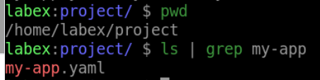
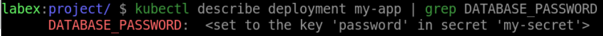
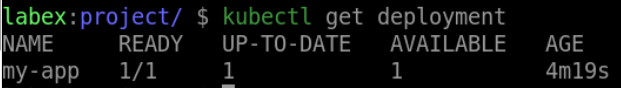

# Use the Secret in Your Application

## Introduction

The created Secret will eventually be used in Pods of different types. In this step, we will take you through how to inject Secret into the Pods controlled by Deployment in the form of ENV.

## Target

Your goal is to create a deployment called `my-app` using the `nignx:latest` image. This deployment specifies a single container running your application, which uses the `DATABASE_PASSWORD` environment variable to get the database password. The value of `DATABASE_PASSWORD` is taken from the`my-secret` secret.

## Result Example

Here is an example of what you should be able to accomplish at the end of this step:

1. Create a YAML file called `my-app.yaml` for the `my-app` Deployment.This deployment specifies a single container running your application, which uses the `DATABASE_PASSWORD` environment variable to get the database password. The value of `DATABASE_PASSWORD` is taken from the`my-secret` secret.

2. Use the `kubectl apply` command to deploy the file `my-app.yaml`.

3. Verify that the Deployment was created. 

## Requirements

To complete this challenge, you will need:

- A Kubernetes cluster has been installed and configured as required.
