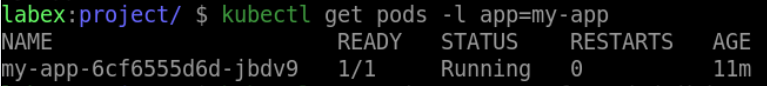

# Verify the Configuration

## Introduction

In Kubernetes, verifying the configuration of your application is an important step in ensuring that it is running smoothly and is accessible to users. In this step, we will learn how to verify the configuration of your application.

## Target

Your goal is to go into the deployment's Pod called `my-app` to verify that the environment variable `DATABASE_PASSWORD` that references the secret is in effect.

## Result Example

Here is an example of what you should be able to accomplish at the end of this step:

1. Find the name of the pod running with the `my-app` Deployment.

2. Go into the container and verify that the `DATABASE_PASSWORD` environment variable is in effect.

## Requirements

To complete this challenge, you will need:

- A Kubernetes cluster has been installed and configured as required.
