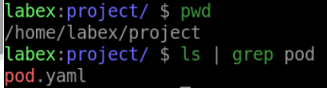
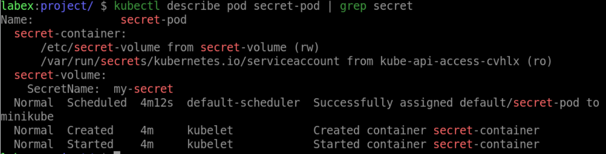

# Mount the Secret as a Volume in a Pod

## Introduction

In Kubernetes, you can not only refer to the contents of the secret using environment variables, but you can also mount the contents of the secret to the corresponding directory of the pods using mounts. In this challenge, we will learn how to mount the secret as a volume in a pod.

## Target

Your goal is to create a deployment called `secret-pod` using the `nignx:latest` image. This deployment will specify a single container running your application, which will mount the secret named `my-secret` in the container's `/etc/secret-volume` directory.

## Result Example

Here is an example of what you should be able to accomplish at the end of this step:

1. Create a YAML file called `pod.yaml` for the `secret-pod` Deployment.This deployment specifies a single container running your application, which will mount the secret named `my-secret` in the container's `/etc/secret-volume` directory.

2. Use the `kubectl apply` command to deploy the file `pod.yaml`.

## Requirements

To complete this challenge, you will need:

- A Kubernetes cluster has been installed and configured as required.
