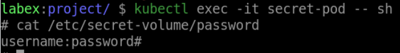

# Verify the Secret as a Volume in a Pod

## Introduction

In this step, we will learn how to verify the configuration of your application.

## Target

Your goal is to verify that the files in `secret-pod`'s mount directory `/etc/secret-volume` and their contents match the contents of `my-secret`.

## Result Example

Here is an example of what you should be able to accomplish at the end of this step:

1. Find the name of the pod running with the `secret-pod` Deployment.

2. Verify that the files in `secret-pod`'s mount directory `/etc/secret-volume` and their contents match the contents of `my-secret`.

## Requirements

To complete this challenge, you will need:

- A Kubernetes cluster has been installed and configured as required.
