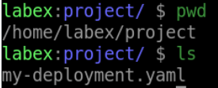
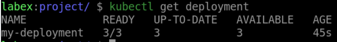

# Create a Deployment

## Introduction

In Kubernetes, a Deployment is a high-level controller that manages Pods, providing a simple way to create and update them. In this step, we will learn how to create a Deployment.

## Target

Your goal is to create a Deployment called `my-deployment` with a replica count of `3` in Kubernetes using the `nginx:latest` image.

## Result Example

Here is an example of what you should be able to accomplish at the end of this step:

1. Create a YAML file called `my-deployment.yaml` with `3` replicas, running an Nginx container.

2. Create the `my-deployment` Deployment.

3. Verify that the Deployment has been created.

## Requirements

To complete this challenge, you will need:

- A Kubernetes cluster has been installed and configured as required.
