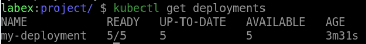

# Scale the Deployment

## Introduction

In Kubernetes, scaling a Deployment is an important step in managing your application's performance and ensuring that it can handle increased traffic. In this step, we will learn how to scale a Deployment.

## Target

Your goal is to extend the number of replicas of the Deployment with the name `my-deployment` to `5`.

## Result Example

Here is an example of what you should be able to accomplish at the end of this step:

1. Scale up the `my-deployment` Deployment to 5 replicas.

2. Verify that the Deployment has been scaled.

## Requirements

To complete this challenge, you will need:

- A Kubernetes cluster has been installed and configured as required.
