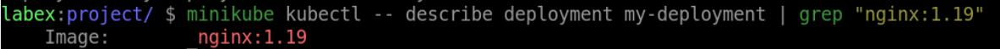
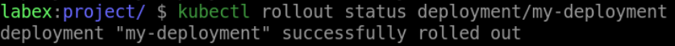

# Update the Deployment

## Introduction

In Kubernetes, updating a Deployment is an important step in managing your application's functionality and ensuring that it is up-to-date with the latest changes. In this step, we will learn how to update a Deployment.

## Target

Your goal is to change the image of the Deployment with the name `my-deployment` to `nginx:1.19`.

## Result Example

Here is an example of what you should be able to accomplish at the end of this step:

1. Change the image of the Deployment with the name `my-deployment` to `nginx:1.19`.

2. Verify that the Deployment has been updated.

## Requirements

To complete this challenge, you will need:

- A Kubernetes cluster has been installed and configured as required.
