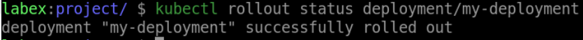

# Rollback the Deployment

## Introduction

In Kubernetes, rolling back a Deployment is an important step in managing your application's functionality and ensuring that it is running smoothly. In this step, we will learn how to rollback a Deployment.

## Target

Your goal is to roll back the Deployment with the name `my-deployment` to a previous version operation.

## Result Example

Here is an example of what you should be able to accomplish at the end of this step:

1. Rollback the `my-deployment` Deployment to the previous version.

2. Verify that the Deployment has been rolled back.

## Requirements

To complete this challenge, you will need:

- A Kubernetes cluster has been installed and configured as required.
