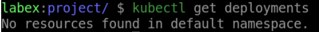

# Clean up

## Introduction

In Kubernetes, cleaning up a Deployment is an important step in managing your application's resources and ensuring that unnecessary resources are not consuming valuable system resources. In this step, we will learn how to clean up a Deployment.

## Target

Your goal is to clean up the Deployment with the name `my-deployment`.

## Result Example

Here is an example of what you should be able to accomplish at the end of this step:

Delete the `my-deployment` Deployment

## Requirements

To complete this challenge, you will need:

- A Kubernetes cluster has been installed and configured as required.
