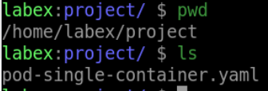
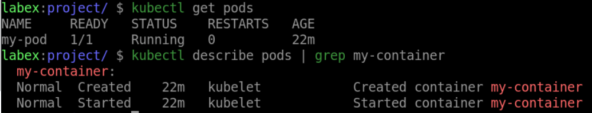

# Create a Pod with a Single Container

## Introduction

In this step, we will learn how to create a Pod with a single container in Kubernetes.

## Target

Your goal is to deploy a Pod named `my-pod` with a single container named `my-container` in your Kubernetes cluster with the `nginx:latest` image.

## Result Example

Here is an example of what you should be able to accomplish at the end of this step:

1. Create a Pod YAML file called `pod-single-container.yaml` on the `Target`.

2. Run the `kubectl apply` command to deploy the pod.

## Requirements

To complete this challenge, you will need:

- A Kubernetes cluster has been installed and configured as required.
