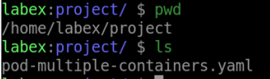
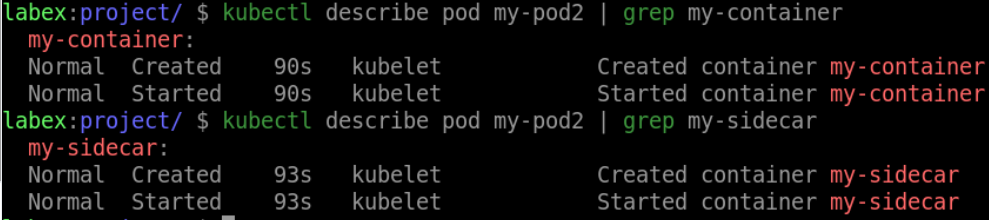

# Create a Pod with Multiple Containers

## Introduction

In this tutorial, we will explore how to create a Pod with multiple containers in Kubernetes.

## Target

Your goal is to create a multi-container Pod called `my-pod2` with one container called `my-container` using the `nginx:latest` image and the other container called `my-sidecar` using the `busybox:latest` image.

## Result Example

Here is an example of what you should be able to accomplish at the end of this step:

1. Create a Pod YAML file called `pod-multiple-containers.yaml` on the `Target`.

2. Run the `kubectl apply` command to deploy the pod.

## Requirements

To complete this challenge, you will need:

- A Kubernetes cluster has been installed and configured as required.
