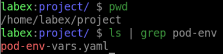

# Create a Pod with Environment Variables

## Introduction

In this step, we will learn how to create a Pod with environment variables in Kubernetes. Environment variables are a powerful way to pass configuration information to containers at runtime.

## Target

Your goal is to create a Pod called `my-pod3` with an environment variable via `nginx:latest` with a Key of `MY_ENV_VAR` and a value of `Hello World!`.

## Result Example

Here is an example of what you should be able to accomplish at the end of this step:

1. Create a Pod YAML file called `pod-env-vars.yaml` on the `Target`.

2. Run the `kubectl apply` command to deploy the pod.

## Requirements

To complete this challenge, you will need:

- A Kubernetes cluster has been installed and configured as required.
