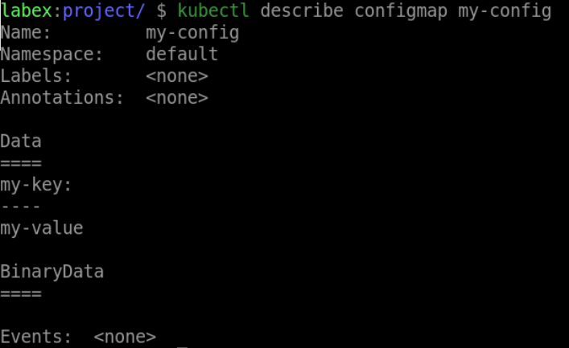
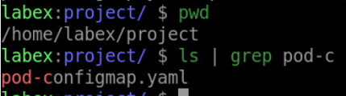
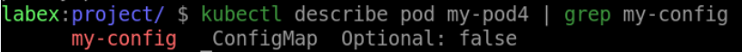

# Create a Pod with ConfigMaps

## Introduction

In this step, we will explore how to create a Pod with ConfigMaps in Kubernetes. ConfigMaps are a powerful way to manage configuration data separately from application code.

## Target

Your goal is to create a ConfigMap called `my-config` and also create a Pod called `my-pod4` to use it.

## Result Example

Here is an example of what you should be able to accomplish at the end of this step:

1. Use `kubectl create configmap` command to Create a ConfigMap named `my-config` with a Key of `my-key` and a value of `my-value`.

2. Create a Pod YAML file called `pod-configmap.yaml`, the pod need to use the created ConfigMap.

3. Run the `kubectl apply` command to deploy the pod.

## Requirements

To complete this challenge, you will need:

- A Kubernetes cluster has been installed and configured as required.
