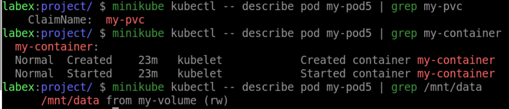

# Create a Pod with Persistent Volumes

## Introduction

In this step, we will learn how to create a Pod with Persistent Volumes in Kubernetes. Persistent Volumes are a powerful way to store and manage data separately from the Pod lifecycle.

## Target

Your goal is to create a PV and a PVC, then use the Pod to mount it.

## Result Example

Here is an example of what you should be able to accomplish at the end of this step:

1. Create a PV named `my-pv` with a capacity of 1Gi and a host path of `/mnt/data`.

2. Create a PVC that requests 1Gi of storage from the PV

3. Create a Pod named `my-pod5` with a single container named `my-container` that runs the Nginx image and has a volume mount at `/mnt/data` that is backed by the PVC named `my-pvc`.

## Requirements

To complete this challenge, you will need:

- A Kubernetes cluster has been installed and configured as required.
